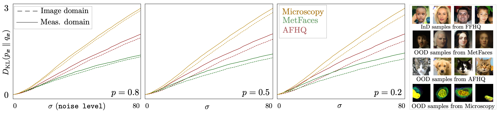

# Unsupervised KL Divergence Estimation for Diffusion Priors (Anonymous Submission)

This repository accompanies our NeurIPS 2025 submission. It provides code to estimate distribution shift in terms of KL divergence directly from measurements in inverse problems using diffusion models—**without requiring access to clean images**.

---



---

## 📝 Abstract

Diffusion models are widely used as priors in imaging inverse problems. However, their performance often degrades under distribution shifts between the training and test-time image distributions. Existing metrics for quantifying distribution shifts typically require access to clean test images, which are unavailable in many inverse problems.
We propose a fully _unsupervised_ metric for estimating distribution shifts using _only_ corrupted measurements and score functions from diffusion models trained on different datasets. We theoretically show that this metric estimates the KL divergence between the training and test image distributions. Empirically, we show that our score-based metric, using only corrupted measurements, closely approximates the true KL divergence computed from clean images. Motivated by this result, we show that aligning the out-of-distribution score with the in-distribution score—using only corrupted measurements—reduces the KL divergence and leads to improved reconstruction quality across multiple inverse problems.

---

## 📁 Project Structure


The project is organized as follows:

```text
code_nips2025/
├── KL_inpainting.py/       # Main experiment scripts (KL calculation)
├── KL_mri.py/              # Main experiment scripts (KL calculation)
├── adapt_inpainting.py/    # Main experiment scripts (adapt OOD)
├── adapt_mri.py/           # Main experiment scripts (adapt OOD)
├── model_zoo/              # Inpainting & MRI diffusion models (.pkl files)
├── testsets/               # Evaluation images (e.g., FFHQ_20)
├── adaptsets/              # Datasets used for adaptation
├── results/                # Output directory for saved metrics
├── torch_utils/            # EDM helper functions
├── EDM/                    # EDM helper functions
├── assets/                 # Figures for visualization (e.g., fig1_v4.png)
├── requirements.txt        # Python dependencies
└── README.md               # Project overview and instructions
```

## 🔧 Setup

To install dependencies:

```bash
pip install -r requirements.txt
```
Or with conda:
```bash
conda create -n diffusion-kl python=3.8
conda activate diffusion-kl
pip install -r requirements.txt
```

## 📦 Pretrained Models

To run the experiments, you need pretrained diffusion models for both in-distribution (InD) and out-of-distribution (OOD) datasets.

We provide the following model checkpoints:

| Domain       | Model Name       | Download Link                                     |
|--------------|------------------|---------------------------------------------------|
| Inpainting   | `ffhq.pkl`       | [Google Drive](https://drive.google.com/drive/folders/1oDmEtW6AUsLeaHQi_6SolmlZ4-kt1KbM?usp=share_link) |
| Inpainting   | `afhq.pkl`       | [Google Drive](https://drive.google.com/drive/folders/1oDmEtW6AUsLeaHQi_6SolmlZ4-kt1KbM?usp=share_link) |
| Inpainting   | `metfaces.pkl`   | [Google Drive](https://drive.google.com/drive/folders/1oDmEtW6AUsLeaHQi_6SolmlZ4-kt1KbM?usp=share_link) |
| Inpainting   | `microscopy.pkl` | [Google Drive](https://drive.google.com/drive/folders/1oDmEtW6AUsLeaHQi_6SolmlZ4-kt1KbM?usp=share_link) |
| Inpainting   | `adapt64.pkl`    | [Google Drive](https://drive.google.com/drive/folders/1oDmEtW6AUsLeaHQi_6SolmlZ4-kt1KbM?usp=share_link) |
| Inpainting   | `adapt128.pkl`   | [Google Drive](https://drive.google.com/drive/folders/1oDmEtW6AUsLeaHQi_6SolmlZ4-kt1KbM?usp=share_link) |
| MRI          | `brain.pkl`      | [Google Drive](https://drive.google.com/drive/folders/1oDmEtW6AUsLeaHQi_6SolmlZ4-kt1KbM?usp=share_link) |
| MRI          | `knee.pkl`       | [Google Drive](https://drive.google.com/drive/folders/1oDmEtW6AUsLeaHQi_6SolmlZ4-kt1KbM?usp=share_link) |
| MRI          | `prostate.pkl`   | [Google Drive](https://drive.google.com/drive/folders/1oDmEtW6AUsLeaHQi_6SolmlZ4-kt1KbM?usp=share_link) |
| MRI          | `adapt64.pkl`    | [Google Drive](https://drive.google.com/drive/folders/1oDmEtW6AUsLeaHQi_6SolmlZ4-kt1KbM?usp=share_link) |

After downloading, place the models in the following structure:
```text
code_nips2025/
├── model_zoo/
│   ├── inpainting/
│   │   ├── ffhq.pkl
│   │   ├── afhq.pkl
│   │   ├── ...
│   │   └── metfaces.pkl
│   └── mri/
│       ├── brain.pkl
│       ├── ...
│       └── knee.pkl
```
---
## 🗂️ Testsets and Adaptsets

We provide the evaluation testsets (used for KL divergence estimation) and adaptation datasets (used for aligning OOD score functions) via the following Google Drive link:

📎 **[Download Testsets](https://drive.google.com/drive/folders/1NKn0dM6P6A240e5xgFVFNvIVBn5OXCze?usp=share_link)**
📎 **[Adaptsets](https://drive.google.com/drive/folders/1THaDKvZozCITe_xS6Fz66zTaZia7izIX?usp=share_link)**

After downloading, place the files in the following structure:
```text
code_nips2025/
├── testsets/
│   ├── FFHQ
│   └── MRI
└── adaptsets/
    ├── Brain_64
    ├── Brain_128
    ├── FFHQ_64.zip
    └── FFHQ_128.zip
```
---
### ✅  **Running the Code**

To estimate KL divergence using inpainting measurements:

```markdown
python KL_inpainting.py --net_list='afhq','metfaces', 'microscopy' --outdir='./results/KL/inpainting' --dataset_path='./testsets/FFHQ/FFHQ_20' --img_size=64 --patch=16 --prob=0.5 --ifnoise=True --meas_noise=0.1
```
To estimate KL divergence using MRI measurements:

```markdown
python KL_mri.py --net_list='knee','prostate' --outdir='./results/KL/mri' --dataset_path='./testsets/MRI/Brain_20' --img_size=320 --acceleration=4 --ifnoise=True --meas_noise=0.1
```
To adapt the OOD score function using InD measurements from inpaiting: 

```markdown
python adapt_inpaiting.py --outdir="./results/adapted_models" --dataset_path='./adaptsets/FFHQ_64.zip' --img_size=64 --inpaint_prob=0.2 --inpaint_patch=16 --transfer='./model_zoo/inpaiting/afhq.pkl'
```

To adapt the OOD score function using InD measurements from MRI: 

```markdown
python adapt_mri.py --outdir="./results/adapted_models" --dataset_path='./adaptsets/Brain_64' --img_size=320 --acceleration=4 --transfer='./model_zoo/mri/prostate.pkl'
```